# Kafka Spring Cloud Stream Application

Ce projet utilise **Apache Kafka** avec **Spring Cloud Stream** pour démontrer la création d’un système de production et de consommation de messages, ainsi qu’un service d’analyse en temps réel.

## Prérequis
Assurez-vous d'avoir installé les outils suivants :
- **Java** (JDK 11 ou supérieur)
- **Apache Kafka**
- **Docker** (facultatif, pour exécuter Kafka et Zookeeper via Docker)

## Démarrage de Kafka et Zookeeper

### Option 1: Téléchargement manuel de Kafka
1. **Télécharger Kafka** depuis le site officiel : [Apache Kafka](https://kafka.apache.org/downloads)
2. **Démarrer Zookeeper** :
   ```bash
   start bin\windows\zookeeper-server-start.bat config/zookeeper.properties
3. **Démarrer Kafka Server** :
   ```bash
   start bin\windows\kafka-server-start.bat config/server.properties

4. **Tester avec kafka-console-producer et kafka-console-consumer :**

    - **Ouvrir une console pour consommer des messages avec `kafka-console-consumer`** :
      ```bash
      start bin\windows\kafka-console-consumer.bat --bootstrap-server localhost:9092 --topic R1 --from-beginning
      ```

    - **Ouvrir une console pour produire des messages avec `kafka-console-producer`** :
      ```bash
      start bin\windows\kafka-console-producer.bat --broker-list localhost:9092 --topic R1
      ```

## Captures d'écran

Voici quelques captures d'écran pour illustrer le processus :

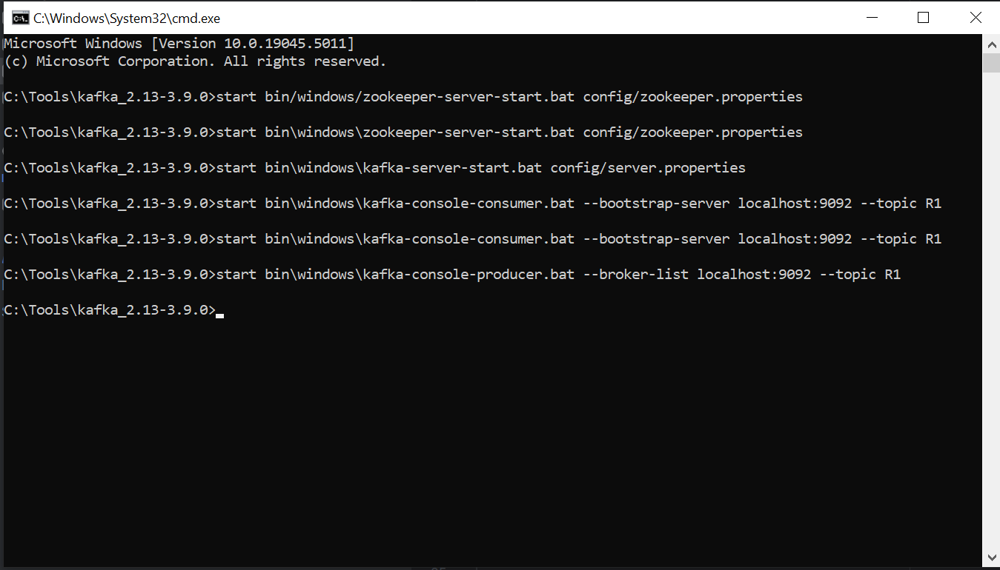
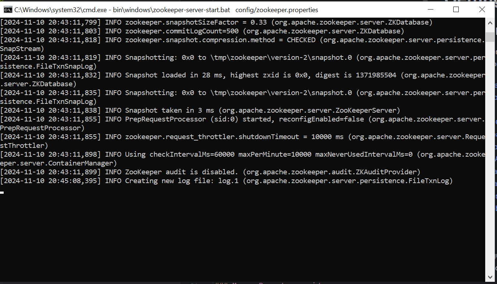
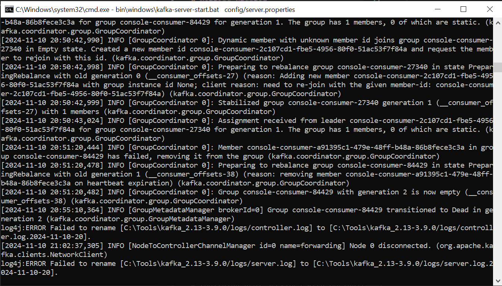
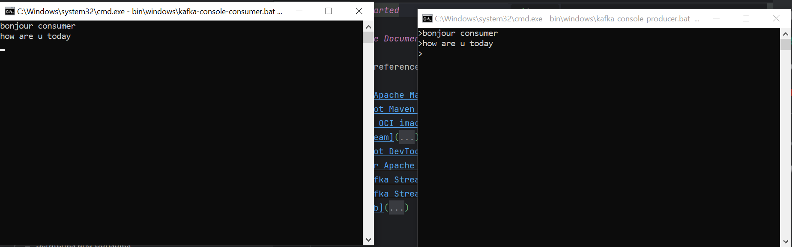
## Fonctionnalités de l'application

1. **Service Producer KAFKA via un Rest Controller**  
   Un producteur Kafka utilisant un contrôleur REST pour envoyer des messages dans un topic Kafka.
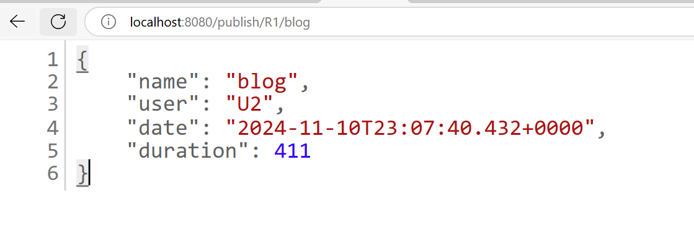

2. **Service Consumer KAFKA**  
   Un consommateur Kafka qui reçoit et affiche les messages envoyés dans un topic Kafka.
    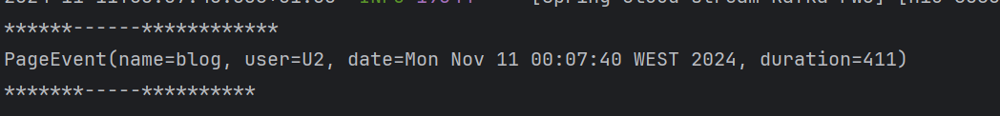
   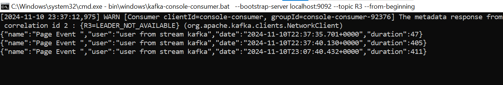
   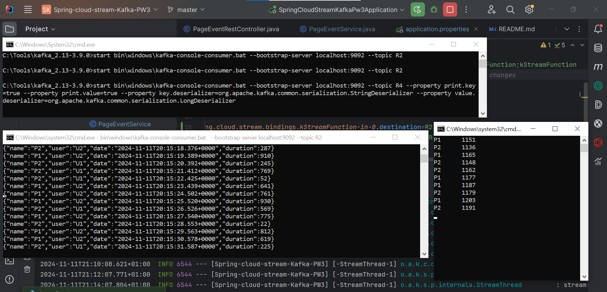


3. **Service Supplier KAFKA**  
   Un fournisseur Kafka générant périodiquement des messages et les envoyant à un topic Kafka.
   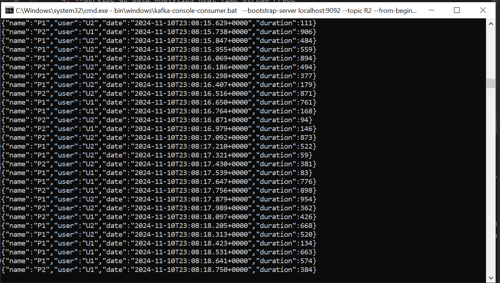

4. **Service de Data Analytics Real Time Stream Processing**  
   Un service d'analyse en temps réel utilisant Kafka Streams pour traiter les données en continu depuis un topic et les envoyer vers un autre topic.
   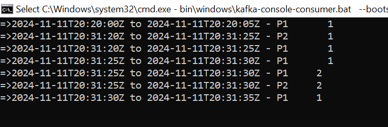

5. **Application Web en Temps Réel**  
   Une application web affichant les résultats de l’analyse des données en temps réel.


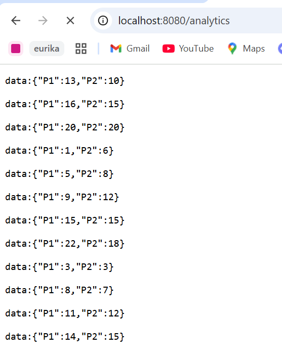
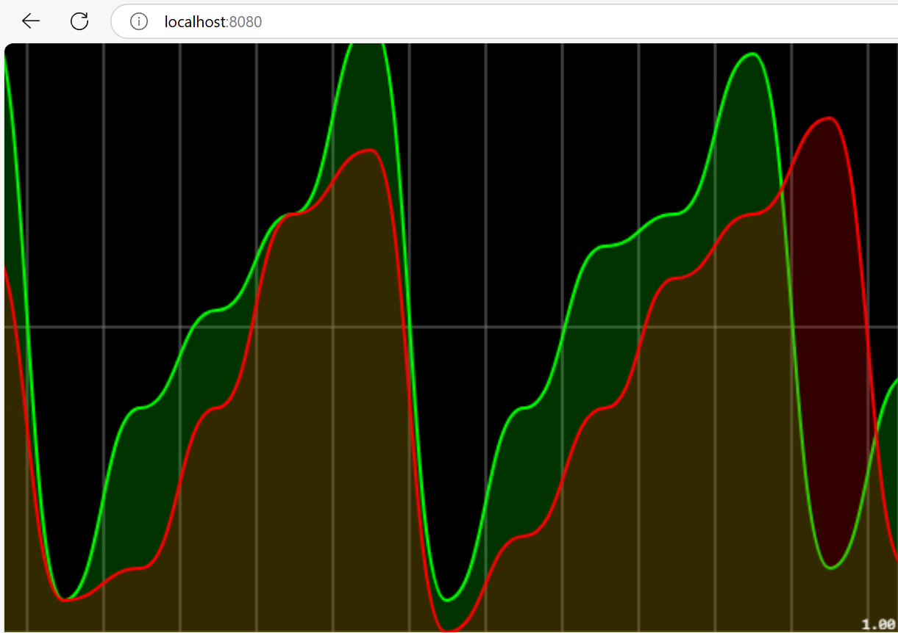


